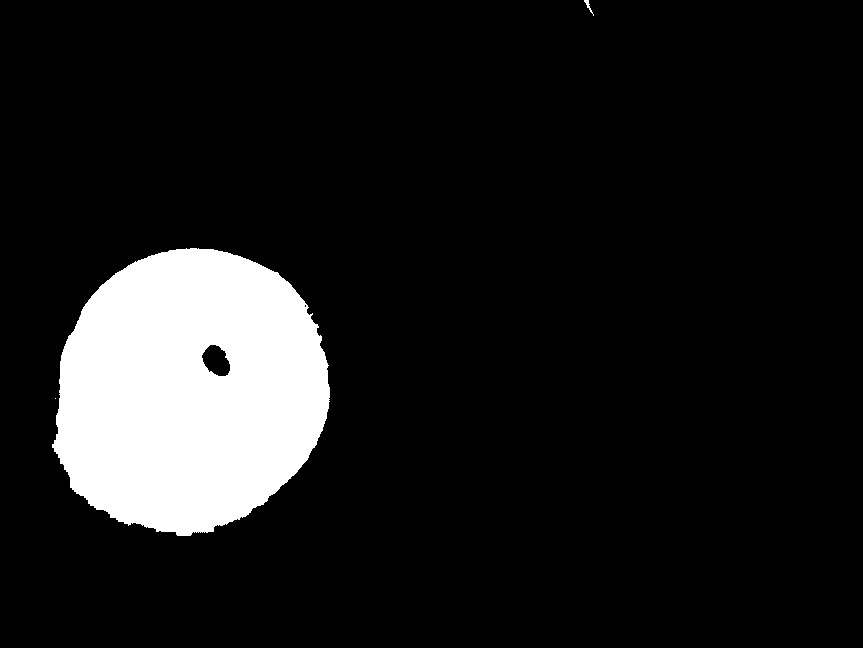
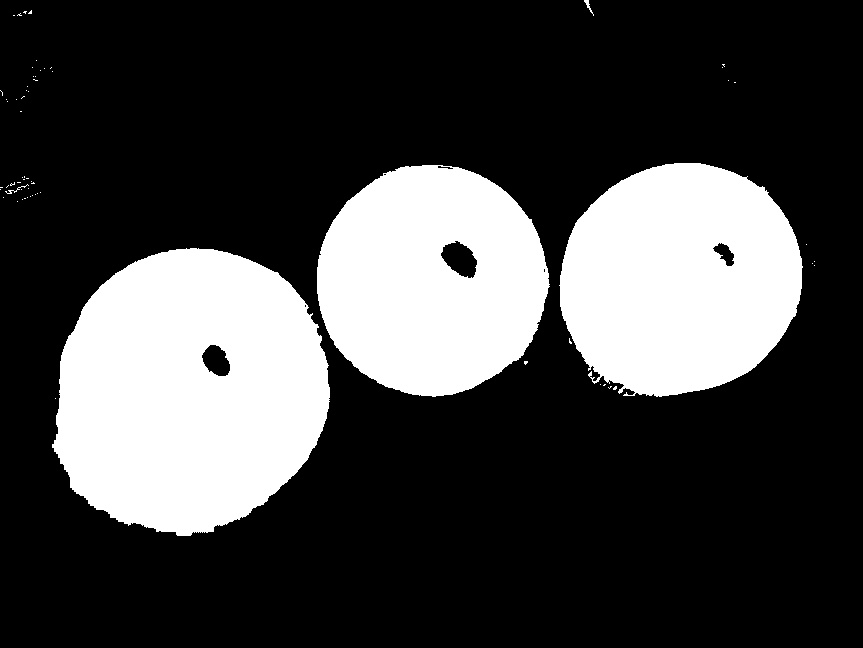
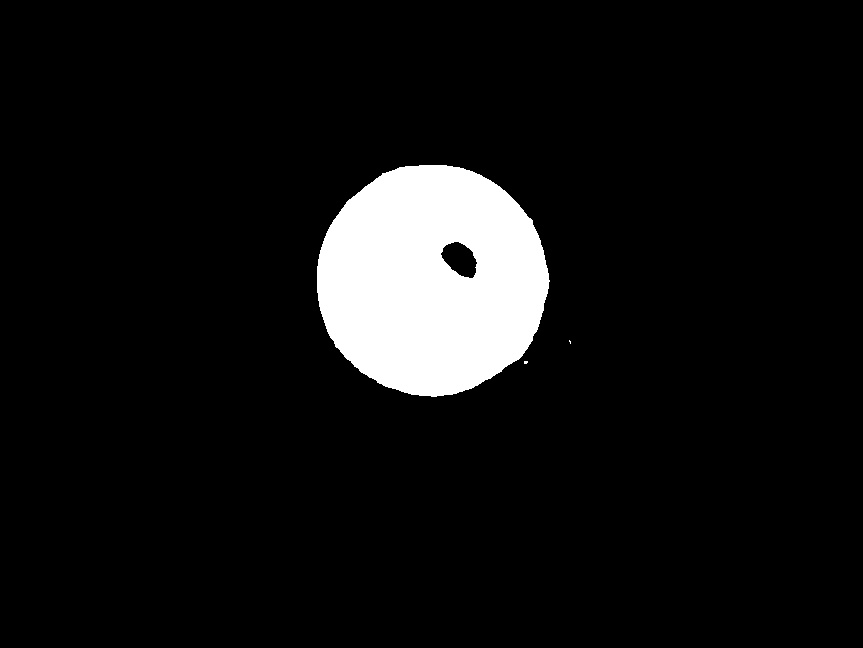
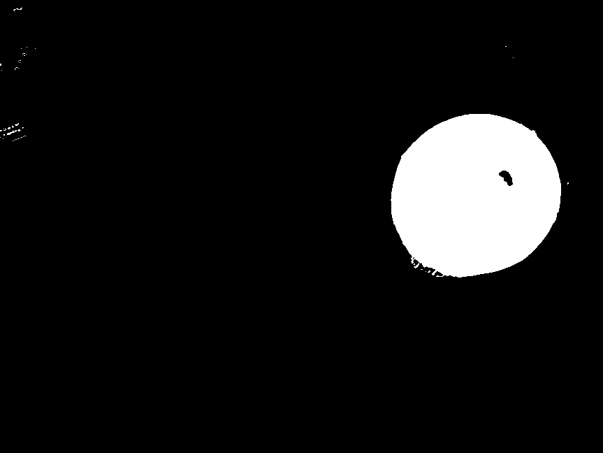

**Vision 1일차 과제1 보고서**
예비단원 김민찬

---

## 1. 가우시안 필터 (Gaussian Filter)
가우시안 필터는 이미지의 노이즈를 제거하기 위해 사용하는 필터이다.
범위 내 픽셀에 가우시안 함수 기반의 가중치를 적용하여 주변 픽셀과 가중 평균을 계산한다.

## 2. 필터 미적용

원본 이미지를 HSV로 변환한 뒤 `cv::inRange()`로 각 색상을 바이너리로 검출한 결과

### Red

### Green

### Blue

### All

## 3. 필터 적용

가우시안 필터(5×5)를 적용한 뒤 동일하게 HSV 변환 및 `cv::inRange()`로 색상을 바이너리로 검출한 결과

### Red

### Green

### Blue

### All

---

## 4. 비교 분석 및 결론

필터를 적용하지 않은 이미지에서는 공 내부에 조명 반사와 카메라 센서 노이즈로 인해
검은 구멍(hole)이 발생하고, 공 외부에도 노이즈 픽셀이 흰색으로 오검출되는 현상이 나타난다.
가우시안 필터를 적용한 이미지에서는 블러 효과로 고주파 노이즈가 제거되어
공 내부가 균일한 흰색으로 채워져야 했으나, 가우시안 필터가 적용되며 흰색 영역에 의해 주변 채도가  
떨어져 반대로 구멍이 커지는 현상이 나타났다. 다만 필터 적용 전에 비해 주변과 비슷한 채도를 가지게 되어  
바이너리 변환 과정에서의 범위를 수정하면 이를 해결 가능할 것이다.
가우시안 필터는 이처럼 HSV 색상 검출 전 노이즈를 억제하는 표준 전처리 단계로,
마스크의 품질을 높여 이후 객체 인식이나 위치 추정의 정확도를 향상시킬 수 있다.
또한 가우시안 필터는 분리 가능한(separable) 커널 구조 덕분에 연산 비용이 낮아
실시간 로봇 비전 시스템에서도 부담 없이 적용할 수 있다.
